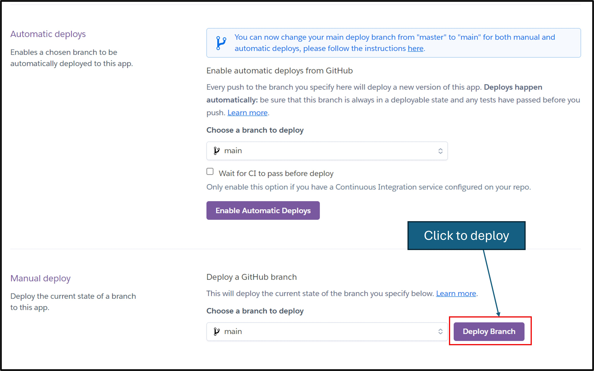

# OEE Calculator

OEE Calculator is a tool to help you to indentify if your process is in a good shape,
the idea is make something simple to calculate your process availability, performance and quality
with this information calculate the OEE factor where will identify if your process have a good Overall equipment effectivess. (OEE)

[OEE calculator](https://oee-calculator-f9cea04d2a91.herokuapp.com/)

## Project Overview

### Purpose:

As part of a course project, this solution serves as an educational resource, demonstrating the application of python development skills to create some kind application or solution. Through the calculator, we aim to explore GoogleCloud API/GoogleSheets/Python/ features, creating an application with interact with the user and cloud services.

### Existing Features

#### Main Menu

- The main menu show the options available for the user.
- The options can be selected usin the number 1 to 4.

#### Add new report

- On this option the user will answer the questions where will be processed and transfered for a file on
google drive.

#### Show All Reports

- On this option the user can acess all the saving data on googlesheet.

#### Load OEE by date

- On this option the user can load the OEE calculated by date.

#### Exit

- This option will close the application and show the credits.

## Technical Design

### Overal Equipment Effectivenss (OEE) explanation

- The OEE is one of the tools used for process improvement, most of time used by a 6sigma Green belt or above.
- The idea is gather the process information and calculate the quality, availability and performance.
- With this three factors calculate the Overall Equipment Effectiveness.
- This data is used to understanding of your process and find oportunities to improvements.

- The data needed to calculate the OEE are:

1. Shift length in minutes - Ex. 480 minutes (8 hours)
2. Short and long break in minutes - Ex. 30 minutes (Lunch break)
3. Down time in minutes - Ex. 45 minutes (Machine Stopped work by overheating)
4. Ideal run rate in unit/parts per minute - Ex. 60 units (The expectation is assembly 60 box per minute)
5. Total parts done per shift in unit - Ex. 19000 units (Box assembled per day shifth length)
6. Rejected parts per shift in units - Ex. 500  (500 boxes were damaged so discarted)

- With this information is necessary to calculate the auxiliar variables which are:

1. Planned Production Time in minutes result from: 
    **Planned production time** = Shift Length - Breaks 
2. Operation time in minutes result from:
    **Operation time** = planned production time - down time 
3. Good pieces in unit result from:
    **Good pieces** = total pieces - rejected pieces

- Them using the auxiliar variables together with the production data is calculate the factors:

1. Availability in %%:
    **Availability** = (operating time/production time)*100
2. Performance in %%:
    **Performance** = ((total piece/operantion time)/Ideal run rate)*100
3. Quality in %% :
    **Quality** = (good pieces/total pieces)*100 
4. Overall OEE = availability * performance * quality

### Flowchart

- For the development and logic decision maker has been draw a flowchart where show all user and system interaction flow.

### Google Cloud

- To the data management strateg, the Google Cloud robust APIs to store and manipulate data effeciently. Specifically, rely on two APIs provided by GoogleCloud:
the Google Drive API and the Google Sheets API. These APIs empower us to seamlessly interact with data stored on Google Drive and within Google Sheets programmatically.
To ensure the utmost privacy and security to the data, has been implemented a sophisticated approach using service accounts.

## Google Drive API

- The Google Drive API allows developers to interact with files and folders stored on Google Drive programmatically. It provides methods for uploading, downloading, searching, and modifying files, as well as managing permissions and metadata.

## Google Sheets API

The Google Sheets API enables developers to read, write, and manipulate Google Sheets data using code. It allows for tasks such as creating new sheets, updating existing ones, inserting and deleting rows and columns, and formatting cells.

## Service Account

- A service account is a special type of Google account that belongs to your application or a virtual machine (VM), instead of an individual user. It's typically used when the application needs to access Google Cloud services programmatically without user interaction. Service accounts are associated with cryptographic key pairs, which can be used to authenticate API requests.

## Technologies

- **Python:** Backend Development
- **Visual Studio Code:** Local IDE.
- **GitHub:** Source code hosting and deployment.
- **Git:** Version control.
- **Heroku:** Cloud Deployment.
- **Google Cloud Services** APIs to access and manipulate cloud based files
- **GoogleDrive** Store data in a googlesheet 

# Libraries
- **googleauth** to access googledrive and googlesheet using the api
- **gspread** Library for googlesheet manipulation
- **datetime** To validate datetime input

## Testing and Fixing Bugs

### Debbugging 

  - For debugging, the python code has been using `print` together with the console logs to help identify bugs, loops, and condition interactions.. 
 
 

### Game and Interaction Tests

After all user implementations, a batch of tests has been conducted, and the results are shown below.

# Test Table

| **Feature**            | **Expected Results**                                              | **Testing Performed**                                       | **Result** |
|:-----------------------:|:------------------------------------------------------------------:|:------------------------------------------------------------:|:----------:|
| **Home Page**           | Load all content without bugs                                      | Open page on computer and mobile                             | Pass       |
| **How to Play Button**  | Open the popup                                                     | Clicked on "How to Play"                                     | Pass       |
| **Select an available dungeon** | Enter the battle                                               | Clicked on Dungeon I                                          | Pass       |
| **Select an unavailable dungeon** | Shows the reason it is not accessible                           | Clicked on Dungeon II, III, and IV                             | Pass       |
| **Select dungeon when overpowered** | Shows the reason it is not accessible                       | Clicked on Dungeon I with more than 150 power                 | Pass       |
| **Social Media Icons**  | Open a new page with social media                                  | Clicked on Instagram, Facebook, and WhatsApp links             | Pass       |
| **Load Hero Information** | Load hero hitpoints and hero status on the top left               | Information loaded correctly                                  | Pass       |
| **Change Background**   | Background should change back to default when the battle is over | Left the battle and observed the background change to default | Pass       |

# Battle Screen - Buttons

| **Feature**            | **Expected Results**                                              | **Testing Performed**                                       | **Result** |
|:-----------------------:|:------------------------------------------------------------------:|:------------------------------------------------------------:|:----------:|
| **Attack With Full HitPoints** | Attack and defend against the monster                               | Clicked on the attack button | Pass |
| **Attack With Zero HitPoints** | Popup "You are dead"                                              | Clicked on the attack button | Pass |
| **Attack With Zero HitPoints with Health Potion** | Popup "Game over" and suggestion to use a health potion | Clicked on the attack button | Pass |
| **Attack With Zero HitPoints without Health Potion** | Popup "Game over"                                               | Clicked on the attack button | Pass |
| **Use Health Potion with less Hitpoints and more than 0 potions** | Popup showing the amount of life recovered and recover the hero HP | Clicked on the health potion button | Pass |
| **Use Health Potion with full Hitpoints** | Popup showing "You already have full hitpoints" | Clicked on the health potion button | Pass |
| **Run with HitPoints** | Popup asking to confirm if you want to run away; if confirmed, go back to default screen | Clicked on the run button | Pass |
| **Run without HitPoints** | Move back to the main screen, reset status, and show an interaction popup | Clicked on the run button | Pass |

# Battle Screen - Interactions

| **Feature**            | **Expected Results**                                              | **Testing Performed**                                       | **Result** |
|:-----------------------:|:------------------------------------------------------------------:|:------------------------------------------------------------:|:----------:|
| **Hitpoints Bar** | While receiving damage, it updates and changes color to green, yellow, and red depending on the amount of life | Attacked the monster | Pass |
| **Killing a Monster** | Calls the level-up function and increases the hero's status; asks if the user wants to continue in the dungeon; if confirmed, adds status and spawns a new monster | Killed a monster and checked if rewards have been added | Pass |
| **Hero Status Bar** | Being updated after winning a battle | Killed a monster and checked if rewards have been added | Pass |
| **Monster Drop** | 30% chance to get a special item that boosts your status | Killed a monster until getting special rewards and checked if they have been added | Pass |

### Validator Testing

#### HTML

- Using the [Markup Validation Service](https://validator.w3.org), through the URL option has been checked all pages and the results can be found bellow. 

- [HTML content](https://validator.w3.org/nu/?showsource=yes&doc=https%3A%2F%2Fvolneirj.github.io%2Fadventurers-guild%2F)

#### CSS

- Using the [Markup Validation Service](https://validator.w3.org), through the direct input option the CSS code has been checked looking for errors.

- [CSS content](https://jigsaw.w3.org/css-validator/validator?uri=https%3A%2F%2Fvolneirj.github.io%2Fadventurers-guild%2F&profile=css3svg&usermedium=all&warning=1&vextwarning=&lang=en)

#### JavaScript
- Using the [JShint](https://jshint.com/) inspect and validate the JavaScript bellow has a image showing the result.

- Observation: Has been written to include the comments /*jshint esversion: 6 */ /*jshint esversion: 8 */ at the beginning of the JavaScript code to ignore potential warnings related to mismatched versions.

## Accessibility

- Using the lighthouse Developer Tool from google Chrome, the performance, accessibility has been enhanced, improving the images sizes to get a good performance above 90 points.

## Deployment

- **Deploying the project on Github**
  You can deploy this website by using GitPages and following the below steps:

  1. Log in to GitHub
  2. In your Repository section, select the project repository that you want to deploy
  3. In the menu located at the top of this section, click 'Settings'
  4. Select 'Pages' on the left-hand menu - this is around halfway down
  5. In the source section, select branch 'Main' and save
  6. The page is then given a site URL which you will see above the source section, it will look like the following:

- **Forking the GitHub Repository**
  If you want to make changes to your repository without affecting it, you can make a copy of it by 'Forking' it. This ensures your original repository remains unchanged.

  1. Find the relevant GitHub repository
  2. In the top right corner of the page, click the Fork button (under your account)
  3. Your repository has now been 'Forked' and you have a copy to work on

- **Cloning the GitHub Repository**
  Cloning your repository will allow you to download a local version of the repository to be worked on. Cloning can also be a great way to backup your work.

  1. Find the relevant GitHub repository
  2. Press the arrow on the Code button
  3. Copy the link that is shown in the drop-down
  4. Open the terminal 
  5. Move to the folder you want clone it
  6. In the terminal type 'git clone' & then paste the link you copied in GitHub
  7. Press enter and your local clone will be created.
- Live link: [GitHub Link](https://github.com/Volneirj/adventurers-guild)

## Credits

1. **Base Code reference** 

    - I used from the video bellow the idea how I would start the code, as it is using java, I convert the idea to java script, implementing new functions and making the game more dynamic as the example the function bellow, replacing the writing input "1", to my attackButton function which is triggered by a listener.
    - [Java ForBegginers](https://www.youtube.com/watch?v=EpB9u4ItOYU&t=1284s&ab_channel=Codecourse)
    
        

2. **AI Search Engine:**

   - [OpenAI Chat](https://chat.openai.com/)
   - [Perplexity AI](https://www.perplexity.ai/)

3. **Code Validation:**

   - [W3C Jigsaw Validator](https://jigsaw.w3.org/)
   - [JSHint](https://jshint.com/)

### Content

All content used was free material gathered from the following web sites:
- [Freepik](https://www.freepik.com/) - Background.
- [Pixbay](https://pixabay.com/) - Background.
- [CoolText Graphics Generator](https://cooltext.com/) - Logo art and Dungeon Numbers.
- [LeonardAi](https://leonardo.ai/) - Monsters.
